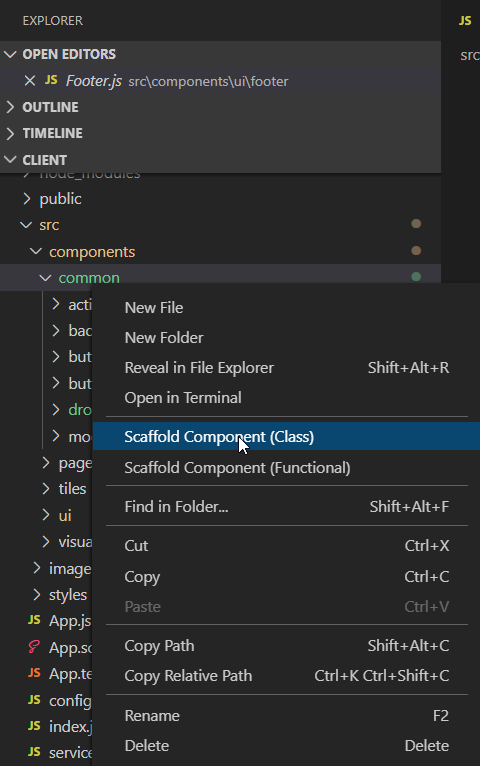

# scaffold-react-component-vscode

VS Code Extension that adds explorer context actions & commands to scaffold a new React component. Uses [scaffold-react-component](https://github.com/squaredup/scaffold-react-component).

